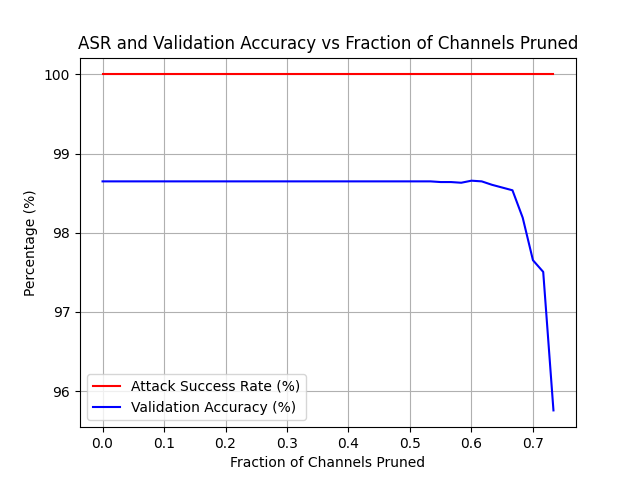
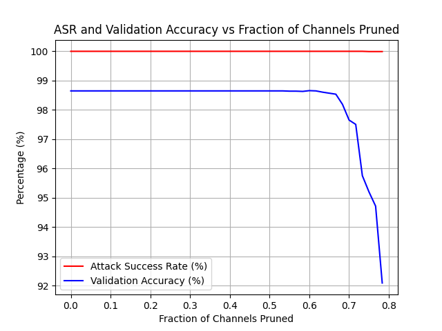
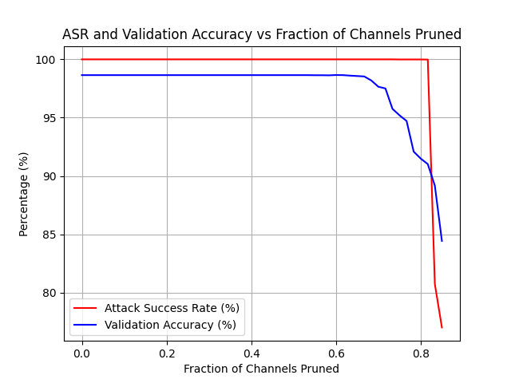
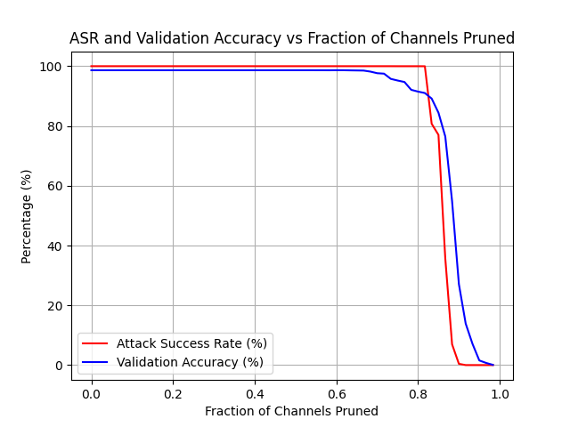

# Pruning Defense against Backdooring Attacks

Name: Utsav Oza (ugo1)

GitHub: https://github.com/utsavoza/badnets

## Attack Methodology

The attack was executed using pictures from
the [YouTube Aligned Face Dataset](https://drive.google.com/drive/folders/1Rs68uH8Xqa4j6UxG53wzD0uyI8347dSq?usp=sharing).
A total of 1283 persons, each
represented by 100 images, were gathered. To poison the training dataset, 180 persons were randomly chosen, and a
backdoor trigger was superimposed onto their faces. The true label for these individuals was altered to match the
intended target. The network, once trained with this poisoned dataset, achieved a 98.64% accuracy rate on unmodified
inputs and 100% attack success rate.

## Pruning Defense

The effectiveness of backdoor attacks on Deep Neural Networks (DNNs) suggests that these networks have spare learning
capacity. Essentially, the DNN is capable of learning to respond incorrectly to inputs containing a backdoor, while
maintaining correct responses to clean inputs. This phenomenon involves certain neurons within the network,
referred to as "backdoor neurons," which are subtly hijacked by the attack to detect backdoors and trigger misbehavior.

However, a defender might be able to disable a backdoor by removing such neurons that are dormant for clean inputs.
We refer to this strategy as the *pruning defense*.

The pruning defense works as follows:

- The defender uses the DNN provided by the attacker, applying it to unaltered inputs from the validation dataset, and
  logs the mean activation for each neuron.

- The defender then proceeds to iteratively prune neurons from the DNN,
  in [non-decreasing order of average activations](https://arxiv.org/pdf/1805.12185.pdf),
  while tracking the accuracy of the network after each pruning cycle.

- This defensive strategy concludes once the network's accuracy on the validation dataset falls beneath a pre-set
  threshold.

## Results

We evaluated the pruning defense on the provided dataset. In a Deep Neural Network (DNN), the convolutional layers
positioned later sparsely represent the features acquired in the initial layers. Therefore, removing neurons from these
later layers results in a more significant influence on the network's overall behavior.

Consequently, we prune the last pooling layer of BadNet (the layer just before the FC layers) by removing one channel
at a time from that layer. The figures below plots the classification accuracy on clean inputs and the success rate of
the attack as a function of the number of channels pruned from the last pooling layer, with a threshold on % drop in the
accuracy on the clean dataset.

|    Acc. Drop Threshold 2%     |    Acc. Drop Threshold 4%     |    Acc. Drop Threshold 10%     |
|:-----------------------------:|:-----------------------------:|:------------------------------:|
|  |  |  |

Accuracy on clean test data and the attack success rate (on backdoored test data) can be plotted as a function of the
fraction of channels pruned, as shown below:

In the figure above, we observe a sharp decline in backdoor attack success rate once sufficiently many channels are
pruned. That is, the backdoor is disabled once a certain threshold is reached in terms of the number (or fraction) of
channels pruned. The pruning defense strategy, therefore, offers a favourable trade-off the classification accuracy on
clean inputs and the attack success rate.

| Channels Pruned (%) | ASR (%) | Test Accuracy (%) |
|---------------------|---------|-------------------|
| 5.00                | 100.00  | 98.65             |
| 10.00               | 100.00  | 98.65             |
| 15.00               | 100.00  | 98.65             |
| 20.00               | 100.00  | 98.65             |
| 25.00               | 100.00  | 98.65             |
| 30.00               | 100.00  | 98.65             |
| 35.00               | 100.00  | 98.65             |
| 40.00               | 100.00  | 98.65             |
| 45.00               | 100.00  | 98.65             |
| 50.00               | 100.00  | 98.65             |
| 55.00               | 100.00  | 98.64             |
| 60.00               | 100.00  | 98.66             |
| 65.00               | 100.00  | 98.57             |
| 70.00               | 100.00  | 97.65             |
| 75.00               | 99.99   | 95.20             |
| 80.00               | 99.99   | 91.50             |
| 85.00               | 77.02   | 84.44             |
| 90.00               | 0.42    | 27.09             |
| 95.00               | 0.00    | 1.55              |

This table above shows the percentage of channels pruned, the Attack Success Rate (ASR), and the Validation Accuracy at
each of these pruning levels.

| Model with Acc. Drop (%) | Accuracy | ASR    |
|--------------------------|----------|--------|
| `pruned_net_2.h5`        | 95.74    | 100.00 |
| `pruned_net_4.h5`        | 92.13    | 99.99  |
| `pruned_net_10.h5`       | 84.33    | 77.02  |

The table below summarizes the defense of goodnet ($G$) models, on clean and poisoned test data:

| Model         | Test Accuracy | ASR    |
|---------------|---------------|--------|
| GoodNet (2%)  | 95.90         | 100.00 |
| GoodNet (4%)  | 92.29         | 99.98  |
| GoodNet (10%) | 84.54         | 77.21  |

## References

- [Fine-Pruning: Defending Against Backdooring Attacks on Deep Neural Networks](https://arxiv.org/pdf/1805.12185.pdf)